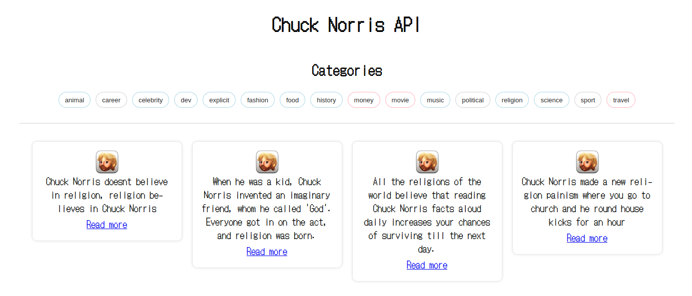

# Getting Started with Chuck Norris API Mini Project

#
# GraphQL Server

cd into the `/server` directory, assuming you have [npm](https://www.npmjs.com/get-npm) installed, you can install the project dependencies(node_modules) by running:

### `npn i` or `npn install`

After successfully installation of dependencies, to start a local server run;

### `npm start`

## Note: You can also use yarn ('',)

This runs the app in the development mode. 
Open [http://localhost:4000/graphql](http://localhost:4000/graphql) to view the graphql playground in the browser.

## Use this code in the graghql payground to test if service works;

### For List Categories

### `{ categories }`

### For Jokes by Category

### `{ jokes(category: "music") { icon_url value url } }`

#

# REACT APOLLO CLIENT

cd into the `/client` directory, you can install the project dependencies(node_modules) by running:

### `npn i` or `npn install`

After successfully installation of dependencies, to start a local development build, run;

### `npm start`

## Note: You can also use yarn ('',)

This runs the app in the development mode. 
Open [http://localhost:3000](http://localhost:3000) to view the graphql in the browser.
